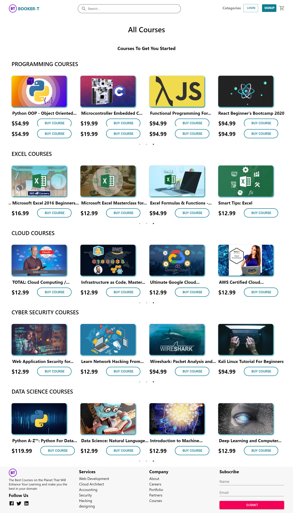
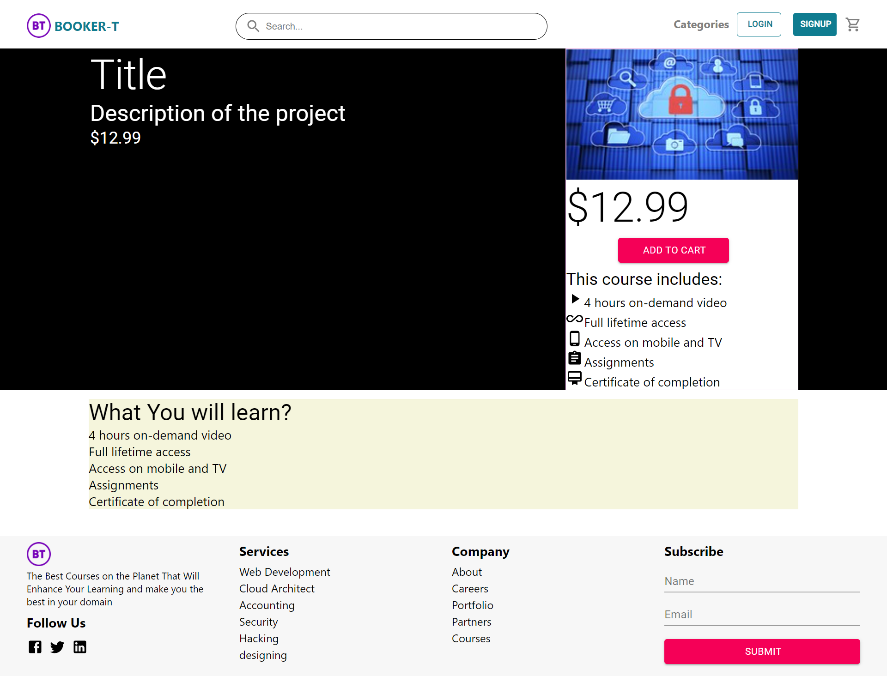
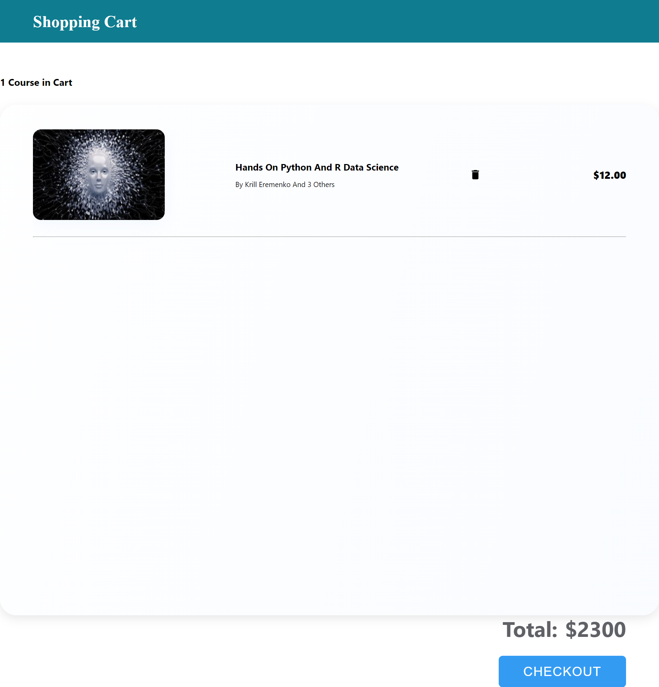
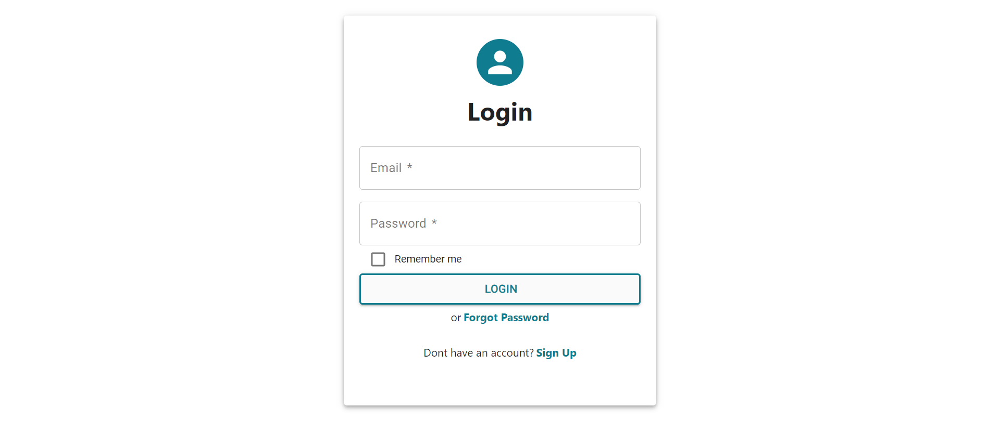
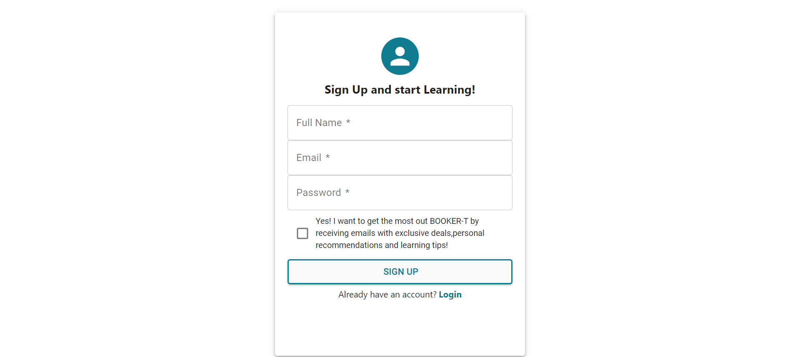
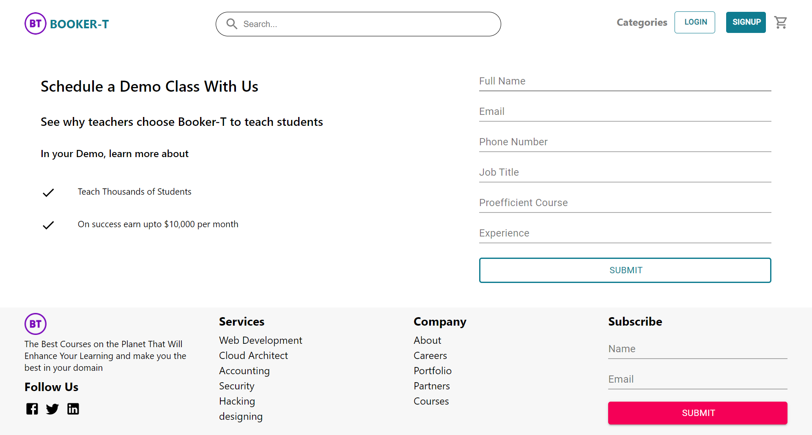

# BOOKER-T

*** Developed By : ***
- Alwaz Qazi
- Samit Karim
- Ubaidullah Rao
- Zaid Sultan

This application is made with the MERN stack. It is an E-learning platform. 
It consists of a
- home page 

- All Courses page

- Single Course detail page

- Cart page

- Login

- Signup

- Teach page

## packages Installed

- Material UI
- React Slick
- Axios
- Body Parser
- Cors
- dotenv
- express
- jsonwebtoken
- mongoose
- nodemon
- react-custom-scroll-bar
- react-dom
- react-redux
- react-router-dom
- react-stripe-checkout
- slick-carousel
- react-text-truncate
- stripe
- uuid

